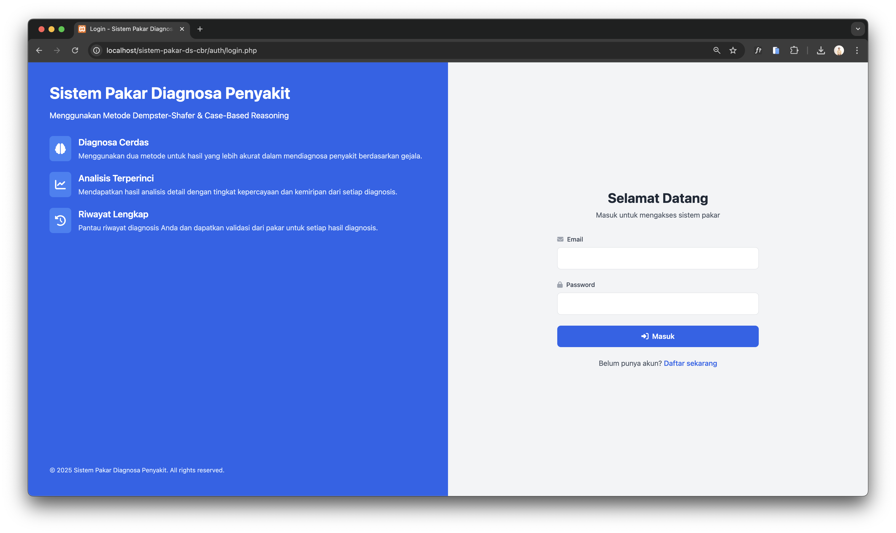
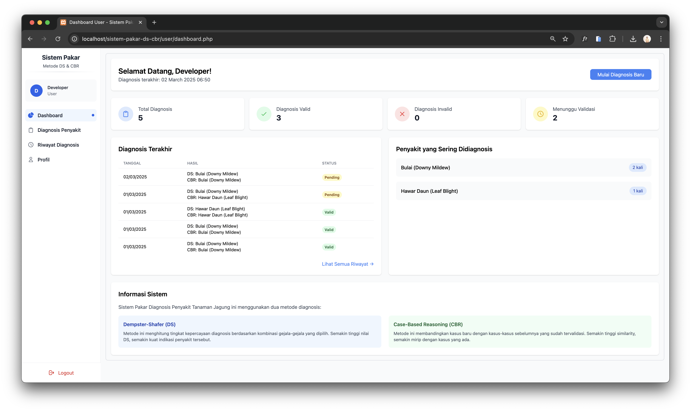
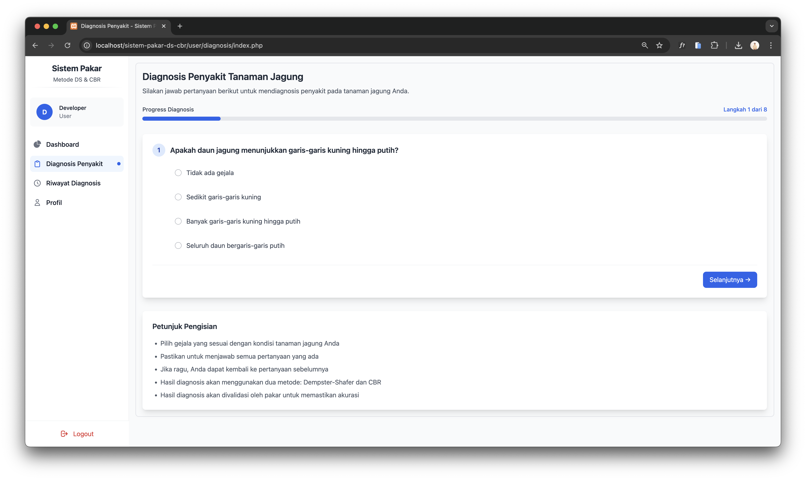
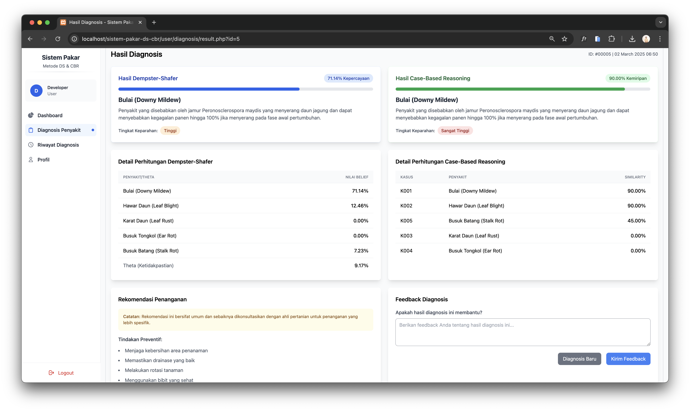
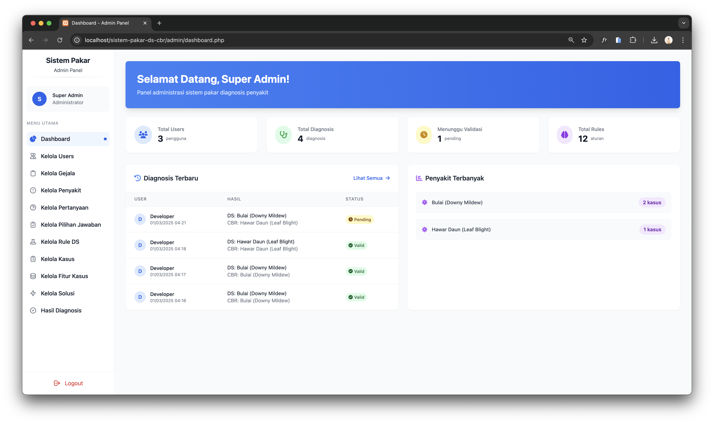
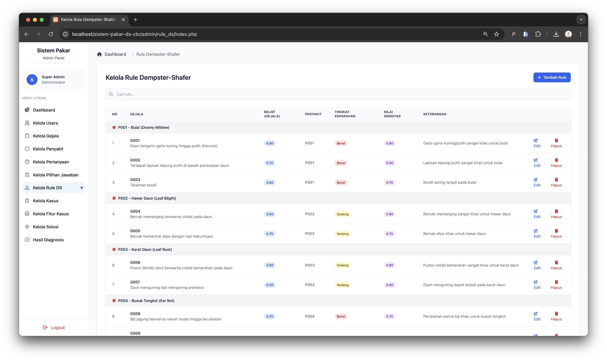

# Corn Plant Disease Expert System

## Project Description

The Corn Plant Disease Expert System is a web-based application designed to help farmers and agricultural practitioners diagnose diseases in corn plants. This system employs two artificial intelligence methods: Dempster-Shafer (DS) and Case-Based Reasoning (CBR) to provide accurate diagnoses based on observed symptoms.

## Key Features

- **Disease Diagnosis**: Users can answer a series of questions about symptoms observed on their corn plants to receive a disease diagnosis.
- **Dual-Method Analysis**: Utilizes two AI methods (Dempster-Shafer and Case-Based Reasoning) to enhance diagnostic accuracy.
- **Detailed Diagnosis Results**: Displays diagnosis results with confidence values and similarity scores, along with calculation details for transparency.
- **Expert Validation**: Diagnosis results can be validated by experts to ensure accuracy.
- **Case Management**: The system stores previous cases to improve future diagnosis accuracy.
- **Admin Dashboard**: Specialized interface for administrators to manage disease data, symptoms, rules, and cases.
- **User Dashboard**: User-friendly interface for performing diagnoses and viewing diagnosis history.

## Technologies Used

- **Backend**: PHP 7.4+
- **Database**: MySQL
- **Frontend**: HTML, CSS, JavaScript
- **CSS Framework**: Tailwind CSS, Flowbite
- **JavaScript Libraries**: jQuery, SweetAlert2
- **AI Methods**: Dempster-Shafer, Case-Based Reasoning

## Artificial Intelligence Methods

### Dempster-Shafer (DS)

The Dempster-Shafer method is used to handle uncertainty in disease diagnosis. This method calculates belief values based on symptoms selected by the user and combines them using Dempster's Rule of Combination to obtain a disease diagnosis with the highest confidence value.

DS implementation includes:
- Mass function calculation for each symptom
- Evidence combination using Dempster's Rule of Combination
- Conflict handling between evidence
- Result normalization to obtain final confidence values

### Case-Based Reasoning (CBR)

The Case-Based Reasoning method is used to compare new cases with previously validated cases. This method calculates the similarity between symptoms selected by the user and symptoms in previous cases to find the most similar case.

CBR implementation includes:
- Retrieval of relevant cases from the database
- Local similarity calculation for each feature (symptom)
- Global similarity calculation considering feature weights
- Selection of the case with the highest similarity as the diagnosis result

## Database Structure

The system uses a relational database with the following main tables:
- `penyakit`: Stores corn plant disease data
- `gejala`: Stores disease symptom data
- `solusi`: Stores disease treatment solutions
- `kasus`: Stores previous diagnosis cases
- `pertanyaan`: Stores diagnosis questions
- `pilihan_jawaban`: Stores answer choices for each question
- `rule_ds`: Stores Dempster-Shafer rules
- `fitur_kasus`: Stores case features for CBR
- `hasil_diagnosis`: Stores user diagnosis results
- `penyakit_solusi`: Stores relationships between diseases and solutions

## Installation

1. Clone this repository to your web server
2. Create a new MySQL database
3. Import the `db_sistem_pakar.sql` file into the created database
4. Configure the database connection in the `config/database.php` file
5. Access the application through a browser

## Usage

### Users

1. Register or login to the system
2. Select "Diagnosis" from the dashboard
3. Answer a series of questions about symptoms observed on the corn plant
4. The system will process the answers and display the diagnosis results
5. View detailed diagnosis results and recommended treatment solutions

### Administrators

1. Login as an administrator
2. Manage disease, symptom, and solution data
3. Manage questions and answer choices
4. Validate user diagnosis results
5. Manage cases to improve CBR accuracy
6. View statistics and diagnosis reports

## Screenshots

### Login Page

### User Dashboard

### Diagnosis Process

### Diagnosis Results

### Admin Dashboard

### Data Management

## Contributing

Contributions to improve this system are welcome. To contribute:

1. Fork the repository
2. Create a new feature branch (`git checkout -b feature/AmazingFeature`)
3. Commit your changes (`git commit -m 'Add some AmazingFeature'`)
4. Push to the branch (`git push origin feature/AmazingFeature`)
5. Open a Pull Request

## License

Distributed under the MIT License. See `LICENSE` for more information.

## Contact

Your Name - [email@example.com](mailto:email@example.com)

Project Link: [https://github.com/username/corn-disease-expert-system](https://github.com/username/corn-disease-expert-system)

## Acknowledgements

- [Tailwind CSS](https://tailwindcss.com/)
- [Flowbite](https://flowbite.com/)
- [SweetAlert2](https://sweetalert2.github.io/)
- [jQuery](https://jquery.com/)
